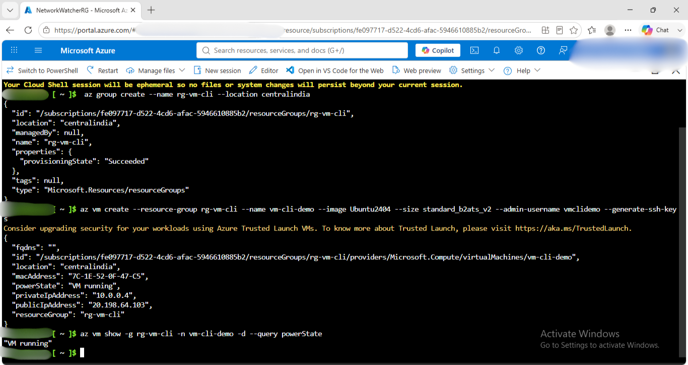
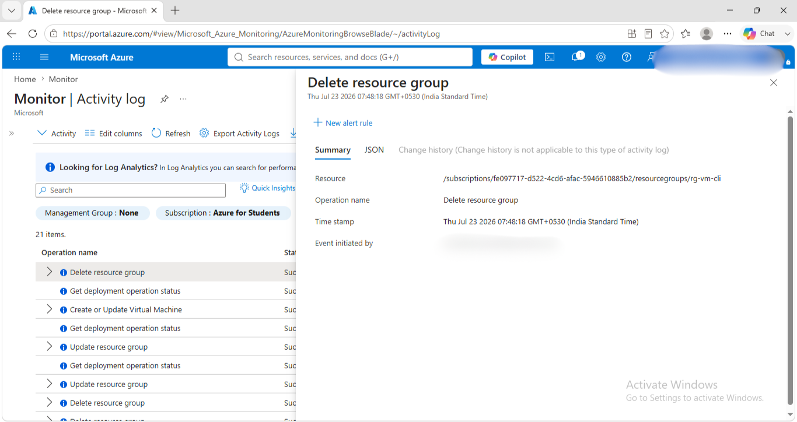

# CLI Deployment

## What I Ran / Clicked
- Navigated to Cloud Shell in portal and selected Bash 
- Created Resource Group by running "az group create --name rg-vm-cli --location centralindia"
- Created Virtual Machine by running " az vm create --resource-group rg-vm-cli --name vm-cli-demo --image Ubuntu2404 --size standard_b2ats_v2 --admin-username vmclidemo --generate-ssh-keys" 
- Checked the VM status by running "az vm show -g rg-vm-cli -n vm-cli-demo -d --query powerState"
- Deleted the Resource Group along with the resources.

## Configuration
- VM name : vm-cli-demo
- Image : Ubuntu 24.04
- Size : Standard b1_ats_v2
- Region : centralindia
- Auth method : SSH keys
- Resources created: VM, NIC, Public IP, NSG, OS Disk 

## Result
- Deployed in: 3 minutes
- Verified running: 
- Resource group deleted: 

## When to Use this method
 CLI is imperative( you tell azure the steps), cross platform and scriptable but doesn't track "desired state" the way bicep/terraform do.

## What I learned
- Cloud Shell automatically securely authenticates for instant access to your resources through the Azure CLI or Azure PowerShell cmdlets.
- All Cloud Shell infrastructure is compliant with double encryption at rest by default. You don't have to configure anything
- Cloud Shell is free, Cloud Shell requires a storage account to host the mounted Azure Files share and regular storage costs apply.