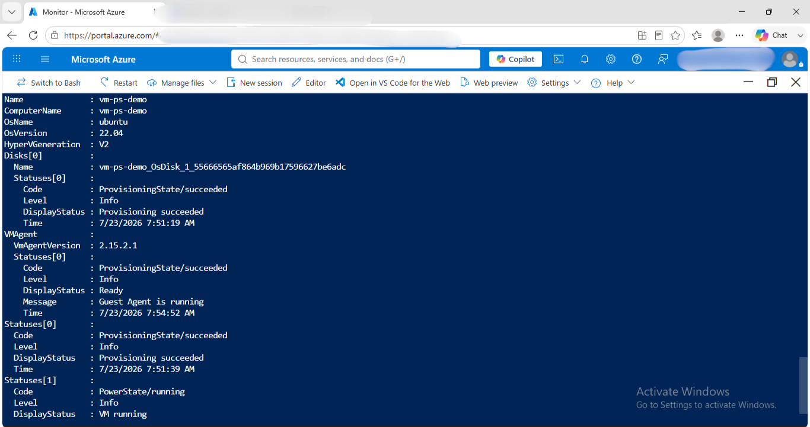
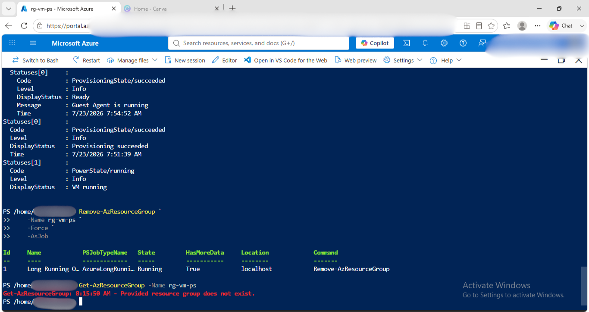

# Powershell Deployment

## What I ran / clicked
- Navigate to Azure Cloud shell via Azure Portal and selcted Powershell 
- Created a Resource Group 
- Created Virtual Machine 
- Checked the status of the Virtual Machine
- Deleted the Full Resource group for cost management 

## Configuration
- VM name: vm-ps-demo
- Image: Ubuntu 22.04 LTS
- Size: Standard_B1s
- Region: centralindia
- Auth method: SSH key  
- Resources created: VM, NIC, Public IP, NSG, OS Disk 

## Result
- Deployed in: 3 minutes
- Verified running: 
- Resource group deleted: 

## When to use this method
Functionality is similar to CLI, but PowerShell objects are more scriptable within larger .NET/Windows automation and it's often the default in Microsoft-heavy enterprises.

## What I learned
- I hit a breaking change parameter requirement and fixed it by reading the error message.
- I learnt to trouble shoot common powershell errors.