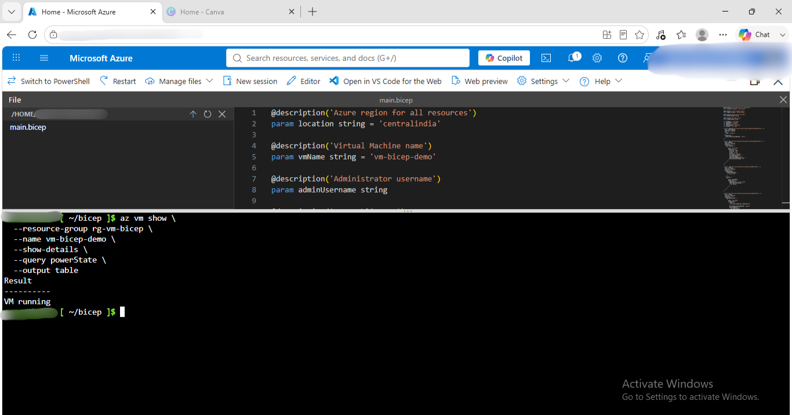
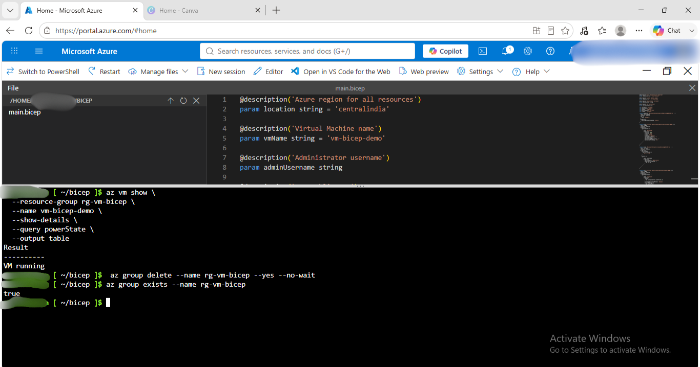

# bicep Deployment

## What I ran
 az group create --name rg-vm-bicep --location centralindia
 ls ~/.ssh
 ssh-keygen -t rsa -b 4096
 ls ~/.ssh
 az deployment group create   --resource-group rg-vm-bicep   --template-file main.bicep --parameters adminUsername=azureuser sshPublicKey="$(cat ~/.ssh/id_rsa.pub)"
 az vm show   --resource-group rg-vm-bicep   --name vm-bicep-demo   --show-details   --query powerState         --output table
 az group exists --name rg-vm-bicep

## Configuration
- Region: Central India
- VM Name: vm-bicep-demo
- VM Size: Standard_D2s_v3
- Operating System: Ubuntu 24.04 LTS
- Authentication: SSH Public Key
- Resources Created: Resource Group, Virtual Network (VNet), Subnet, Network Security Group (NSG), Public IP Address, Network Interface (NIC), Linux Virtual Machine

## Capacity troubleshooting (real-world lesson)
Generated new SSH-key using ssh-keygen.
Passed correct ssh-key during deployment
Verified Bicep syntax and ensured all required parameters were provided.

## Result
- Deployed in: ~8 seconds (per Azure's reported duration)
- Verified running: 
- Resource group deleted: 

## When to use this method
To automate Azure infrastructure deployment.
To deploy the same environment repeatedly and consistently.
For Infrastructure as Code (IaC) in DevOps and CI/CD pipelines.
When managing cloud resources through version-controlled templates.
For creating scalable and reusable Azure deployments.

## What I learned
Learned how to define Azure resources using Bicep syntax.
Learned how to deploy infrastructure using az deployment group create.
Learned how to use parameters for reusable deployments (such as adminUsername and sshPublicKey)