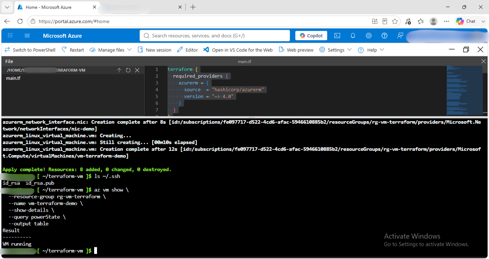
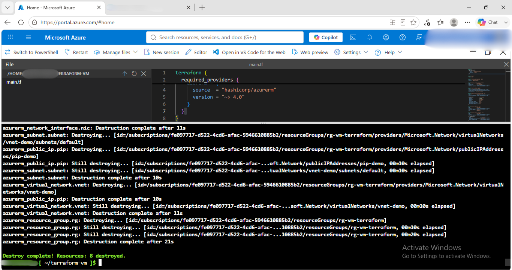

# Terraform Deployment

## What I ran
terraform version
mkdir terraform-vm
cd terraform-vm
code main.tf
terraform init
terraform validate
terraform plan
terraform apply
az vm show \
  --resource-group rg-vm-terraform \
  --name vm-terraform-demo \
  --show-details \
  --query powerState \
  --output table
terraform destroy

## Configuration
- VM name: vm-arm-demo
- Image: Ubuntu 24.04 LTS
- Size: Standard_D2s_v3 (see capacity note below)
- Region: Central India
- Auth: SSH key
- Resources created: VM, NIC, Public IP (Standard SKU), NSG, VNet, Subnet

## Capacity troubleshooting (real-world lesson)
Region: Central India
VM Size: Standard_D2s_v3
Operating System: Ubuntu 24.04 LTS
vCPUs: 2
Memory: 8 GB RAM
Storage: Premium Managed OS Disk
Authentication: SSH Public Key
Network: Static Public IP with SSH (Port 22) enabled.

Terraform initially failed because the SSH public key file (id_rsa.pub) was not found. I generated a new SSH key using ssh-keygen and updated the configuration with the correct public key path. I also verified the Terraform configuration using terraform validate and reviewed the planned changes with terraform plan before deploying.

## Result
- Deployed in: ~15 seconds (per Azure's reported duration)
- Verified running: 
- Resource group deleted: 

## When to use this method
- Terraform is useful when you want to automate Azure infrastructure, deploy the same environment multiple times, manage infrastructure through version control, or integrate infrastructure deployment into CI/CD pipelines. It is also a good choice when working across multiple cloud providers because the same tool supports Azure, AWS, Google Cloud, and many others.

## What I learned
Learned how to define Azure infrastructure using Terraform code.
Understood how Terraform manages resources using Infrastructure as Code (IaC).
Learned the purpose of terraform init, terraform validate, terraform plan, terraform apply, and terraform destroy.